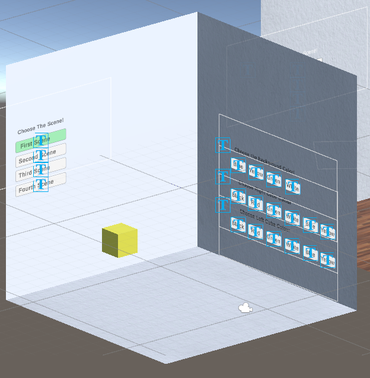
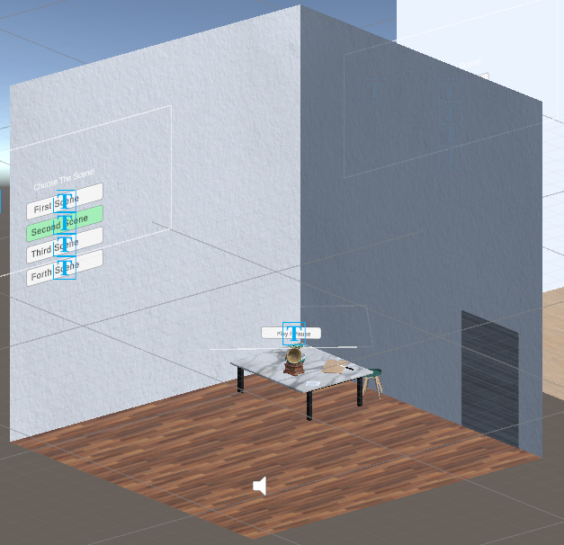
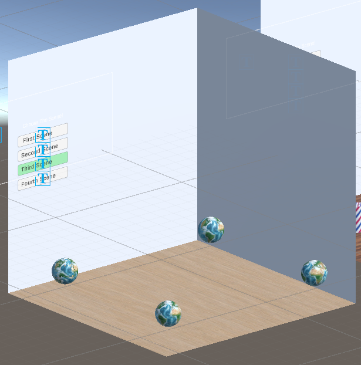
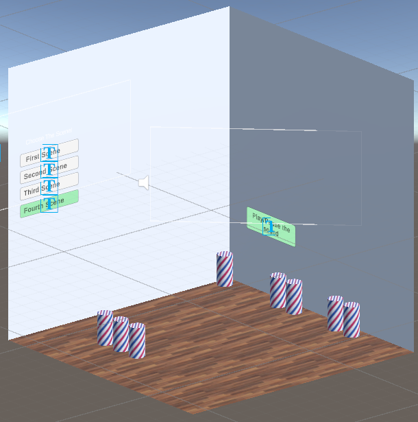

# Virtual Reality Perception Illusion
In this repo you can find a couple of different VR experiments created with Unity and Oculuc Quest 2.

## How to run the experiments

## Scenes
Here is the final version of all scenes. The buttons give teleportation facility by which participants can relocate from one scene to another.

## Scene 1
In this study, we have a room for both eyes, but we will use different colors for objects in each eye, to see how the perception of the users will alter.

In the fist scene, user faces a visual perceptual illusion. There are two different cubes at the exact place which overlap each other and user can see each one with one eye. For example, they can see a yello cube with their left eye and another blue cube with right one. They also can change the color of each cube and the background as well.

## Scene 2
In this scene the user experiences an auditory illusion. the subject is located in the center of the environment and they hear a sound from a location outside their visual cone. User then can just turn their head to left or right and find the source of the sound, but the visual object supposedly emitting the sound is in another direction. There are also some other experiments we did. We, however, have not applied them to the project due to unsatisfactory results in the tuning.
* A sound could be played louder in one channel (ear) than the other
* A sound could be played sooner in one channel (ear) than the other
* A sound could be played with higher or lower pitch in one channel (ear) than the other

## Scene 3
This visual illusion examines the effects of rotation on user's visual perception. There are four spheres with these specifications in four corners of the home:
* First experiment: Two spheres are spinning in different sides (One turns right and the other turns left)
* Second experiment: Two spheres are spinning in the same direction. One, however, spins as twice fast as the other.
* Third experiment: Two spheres spinning. One is turning around z axis, and another spins around x axis.
* Forth experiment: Two spheres are spinning, but one is double size. They both rotate in the same direction. 

We want to examine if it is an uncomfortable experience for the user, or whether or not they have duplicate visions based on the distance or place of the object in the scene. 

## Scene 4
This visual illusion examining user's visual perception. This also examines user's reaction towards 

## Credits
[Nazanin Nakhaie Ahooie](https://github.com/Nawzneen)

[Danial Khoshkholgh](https://github.com/dark-0ne)

[Mehrdad Kaheh](https://github.com/mkahe)

**Supervisor:** [Anna Lavalle](http://lavalle.pl/anna)